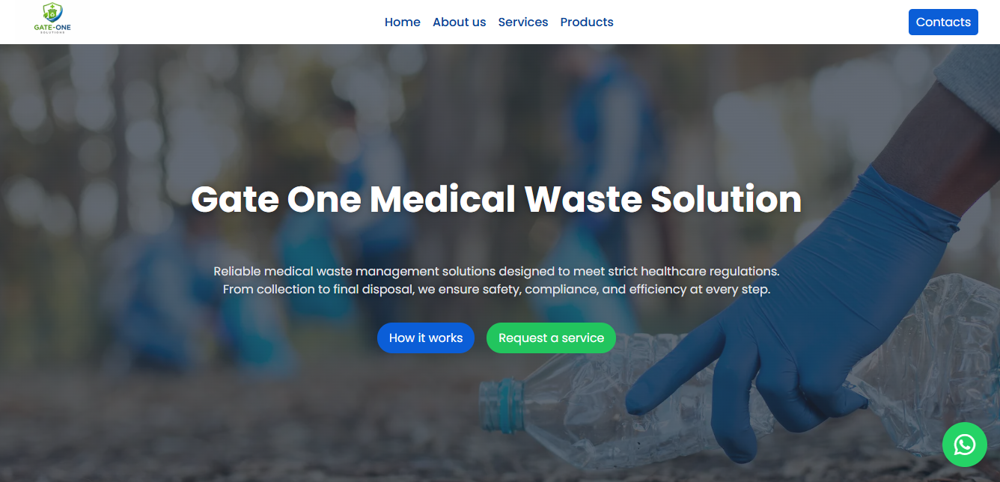

# Gate One Medical Waste Solution

## Description
Gate One Medical Waste Solution is a responsive web application designed to showcase services and solutions for medical waste management. The website is built with HTML, CSS, and JavaScript, providing a clean layout and interactive user experience.

## Technologies Used
- HTML
- CSS
- JavaScript
- React

## Features
- Responsive design for desktop and mobile devices  
- Interactive navigation menu  
- Services section with clear information  
- Contact form with validation  
- Clean and modern layout

## Live Demo
[View Live Demo](https://gateone-solutions.vercel.app/)

## Screenshots

  

## Author
David Thairu

## GitHub Repository
[View Code](https://github.com/davienjo/Gate-one-medical-waste-solution)
